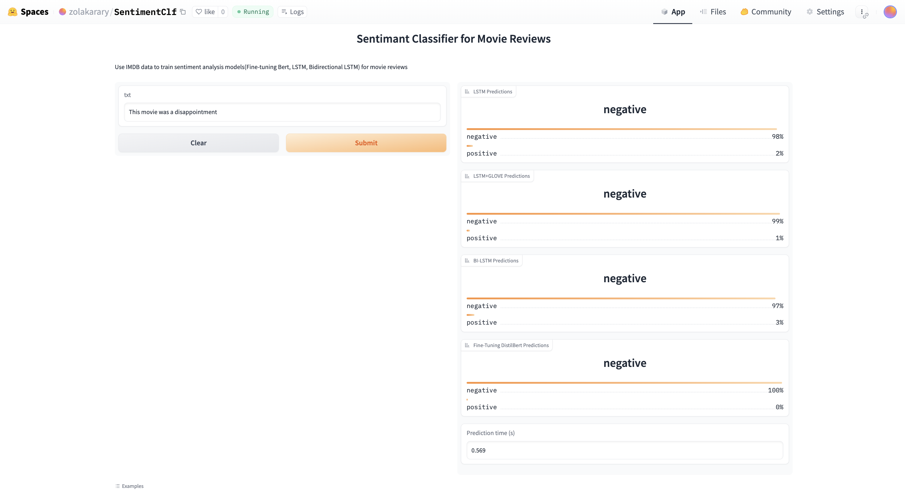

# NLP Sentiment Classification
Sentiment analysis in PyTorch, algorithm implemented as follows:
- LSTM
- LSTM with glove-pretrain embedding weights
- Bidirectional LSTM
- DistilBert Fine-tuning

## Dataset: IMDb
* Download directly: https://ai.stanford.edu/~amaas/data/sentiment/aclImdb_v1.tar.gz
* HuggingFace dataset: https://huggingface.co/datasets/imdb
```python
from datasets import load_dataset
load_dataset('imdb').with_format('torch') # for pytorch format
```

## Glove
Apply pre-train glove pre-train word vector for LSTM embedding weight
* DataSource
    * github: https://github.com/stanfordnlp/GloVe
    * Kaggle: https://www.kaggle.com/datasets/anindya2906/glove6b
* Preprocess: transform gloveweight to gensim format
```bash
unzip glove.6B.zip
python -m gensim.scripts.glove2word2vec --input glove.6B.100d.txt --output glove.6B.100d.w2vformat.txt
```
```python
## load glove pre-train weight
import gensim
word_vec = gensim.models.KeyedVectors.load_word2vec_format('glove.6B.100d.w2vformat.txt', binary=False, encoding='utf-8')
```
## Performance on Training & Test set (for ref)
### Loss
|model| embedding dimention | training epochs |training loss|test loss|
|---|---|---|---|---|
|LSTM|128|7|0.132|0.456|
|LSTM+GLOVE|100|5|0.380|0.389|
|Bidirectional LSTM|128|7|0.125|0.425|
|Fine-tuning DistilBert|128|3|0.382|0.342|

### Accuracy
|model|training accuracy (%) |test accuracy (%)|
|---|---|---|
|LSTM|95.73|84.54|
|LSTM+GLOVE|83.64|82.78|
|Bidirectional LSTM|95.96|84.39|
|Fine-tuning DistilBert|83.10|85.10|

## Demo
Use [gradio](https://www.gradio.app/) to demo model result, please click [link](https://huggingface.co/spaces/zolakarary/SentimentClf) to give it a try!


